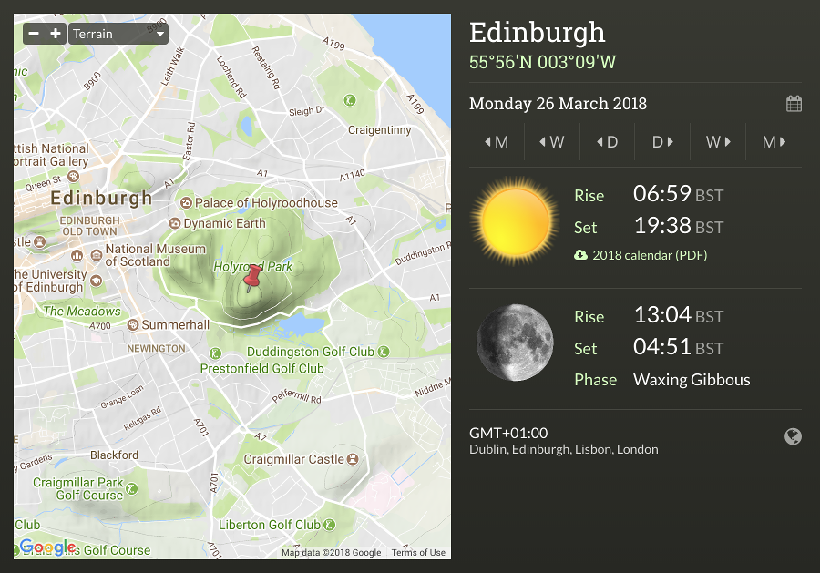
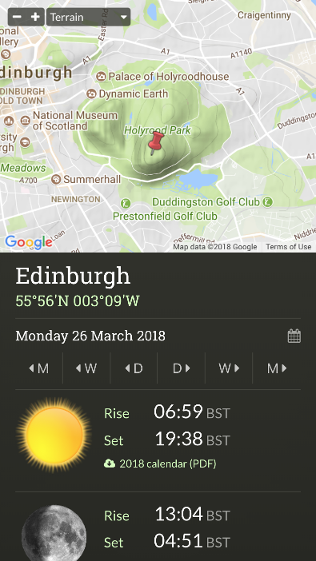

# sunrisesunsetmap.com

This is the source code for [sunrisesunsetmap.com](https://sunrisesunsetmap.com).

This site was originally built in 2005, pre-dating even jQuery, when IE6 was the dominant browser.
It was intended to run on cheap shared hosting.

I have left it alone until recently but have now rebuilt it to modern standards, using ReactJS
and SCSS and replacing the location database and automatic timezone code with Google APIs.

### Screenshots

### Calculations

PHP has built in sunrise/sunset calculation but this site uses its own, thanks to a long history of
being re-written from JavaScript to Java to PHP, with customisations for better time zone support, solar
transit, position calculation etc. The original is in the public domain, used with the kind permission of the
NOAA, and can be found [here](https://www.esrl.noaa.gov/gmd/grad/solcalc/sunrise.html).

I have lost the source of the moon calculations but believe they were also public domain.

### Recent changes

* Mobile support
* Geolocation
* React
* Webpack
* Replaced database of places with Google Geocoding API
* Prefer time zone selection using Google Time Zone API
* Use composer for TCPDF dependency
* Flag sprites
* SCSS
* SCSS Lint
* Docker support
* Heroku support

### Next steps

* Tests

For better performance and a cleaner deployment the APIs could be separated from the front end, with the APIs
run from any PaaS service and the front end hosted on a CDN. The site doesn't have enough traffic to justify
the cost and complexity involved.

### Requirements

* Node >= 8
* PHP > ~5.5, Composer (optional if using Docker on Mac)
* Docker (recommended on Mac)

### Running locally

The `react-scripts` project is used together with a SASS compiler to run the app during development. These watch for
and compile changes to the JS and CSS then apply changes in the browser.

To start the development server:

    cd app
    npm install
    npm start

Now browse to `http://localhost:3000`. The app should run but the React server cannot serve PHP APIs.

You can set up a local nginx or Apache server with PHP, but if you're using a Mac the easiest approach is to use the
included docker wrapper. This serves the PHP API requests itself, and proxies the app requests through to `localhost:3000`,
giving a fully working app. It also runs `composer install` in the container, so you will not need PHP or Composer
installed locally.

**This will only work on a Mac.**

    docker/dev/run.sh

Now browse to `http://localhost:8000` or `https://localhost:8443`.

### Deploying with Docker

A Dockerfile and build/run script can be found in `docker/prod`, along with instructions. These create a self contained
Docker image that can be deployed to a container hosting service. You will need Docker, PHP, Node and Composer installed
in your build environment to build this image.

### Deploying to Heroku

The app can be deployed on Heroku without using Docker. Two Heroku buildpacks are required - PHP to serve the APIs and
generate PDFs, and Node (at deployment time only) to generate the static site.

* Add the app to Heroku: `heroku create your-app-name`
* In the Heroku console, add the PHP and Node buildpacks
* In the Heroku console, add a config var: `API_KEY=<your-google-api-key>`
* You should also change the Google API key in `.env`
* Deploy the app: `git push heroku master`

### Deploying to a VPS

To minimise hosting costs for several low traffic sites, I run this app on a simple VPS setup with nginx and PHP-FPM.
The `zip.sh` script creates a zip file that can be copied to and extracted on a remote server.
